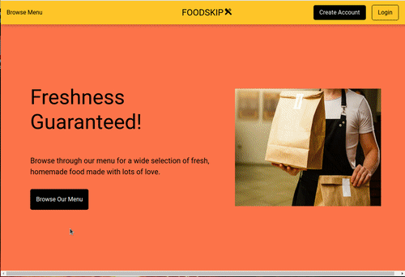
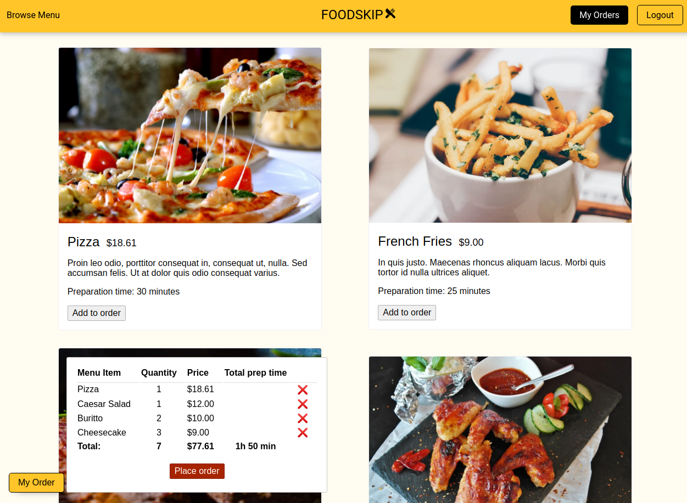
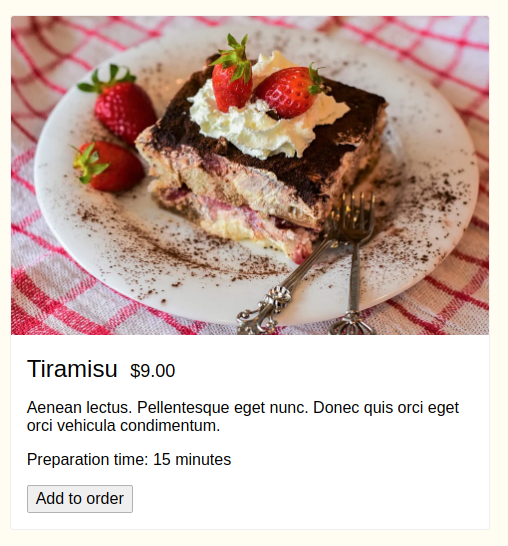
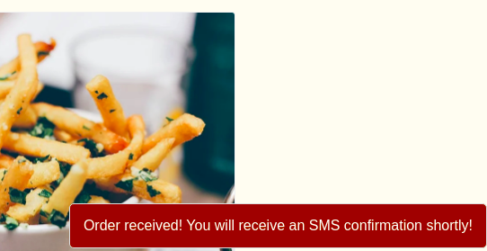
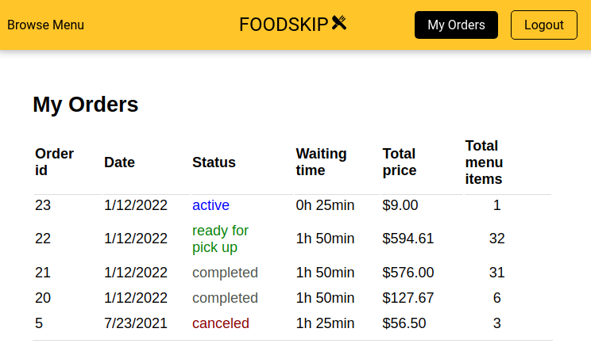

<h1 align="center">
   

   
  FOODSKIP
</h1>
<h3 align="center">Easy and reliable food pick-up ordering service</h3>

  
  
  
  

<h3 align="center"><a  href="https://foodskip.herokuapp.com/">See live</a></h3>

## Description

During the pandemic restaurants, cafes and other food service establishments faced many indoor dining restrictions. As a result food ordering has become a wildly common solution for many people who still want to enjoy their favourite foods. This app offers an easy food-pick up service for it's customers. It serves as an intermediary between the restaurant and the client and integrates Twilio API for SMS notifications.
We, Ruta, Mohamed and Michael, built this app with Node.js, Express and JQuery, using PostgreSQL for development database.

## Interact with the App

You can [interact with the app](https://foodskip.herokuapp.com/) live.
When you click on `log in` button, you will be logged in as user 3. Play around by adding and removing menu items from the order. Refresh the browser to see that your order has not been lost! This app uses the trial version of Twilio service (it only sends sms to verified phone numbers) so you will not be able to receive an sms confirmation for your order.

## Key Features

User:

- Browse menu and orders
- Order food
- SMS notifications when order has been placed and when it is ready for pick-up

Restaurant:

- Update order status
- SMS notifications when a new order has been placed

## Project Screenshots

  

 

  
  
  

 

  

## Getting Started

Follow these steps after setting up a local PostgreSQL database:

1. Create the `.env` by using `.env.example` as a reference: `cp .env.example .env`
2. Update the .env file with your correct local information
3. Install dependencies: `npm i`
4. Fix to binaries for sass: `npm rebuild node-sass`
5. Reset database: `npm run db:reset`

6. Run the server: `npm run local`

- Note: nodemon is used, so you should not have to restart your server

7. Visit `http://localhost:8080/`

## Dependencies

- node 10.x or above
- npm 5.x or above
- pg 6.x
- express
- cookie-session
- pg-native
- pg-promise
- sass
- twilio
- method-override

## Future Improvements

- Registration and login
- Users profile page
- Cancelling orders
